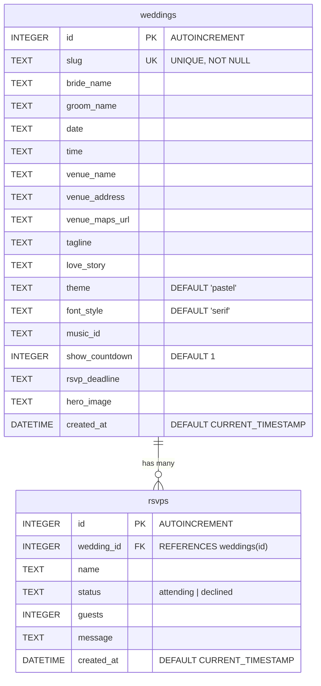

# Everlasting — Tech Stack & Database Schema

> **Everlasting** is a Wedding Page Generator web application that allows users to create, customize, and share personalized wedding invitation landing pages with real-time preview and RSVP tracking.

---

## Tech Stack

### Frontend

| Technology | Version | Purpose |
|---|---|---|
| **React** | 19.0.0 | UI library (component-based SPA) |
| **TypeScript** | ~5.8.2 | Type-safe JavaScript superset |
| **Vite** | 6.2.0 | Build tool & dev server with HMR |
| **TailwindCSS** | 4.1.14 | Utility-first CSS framework |
| **React Router DOM** | 7.13.1 | Client-side routing (SPA navigation) |
| **Motion (Framer Motion)** | 12.23.24 | Animations & page transitions |
| **Lucide React** | 0.546.0 | Icon library |
| **date-fns** | 4.1.0 | Date formatting utilities |
| **clsx** | 2.1.1 | Conditional CSS class utility |
| **tailwind-merge** | 3.5.0 | TailwindCSS class conflict resolution |

**Google Fonts used:** Playfair Display (serif), Inter (sans-serif), Dancing Script (cursive/script)

### Backend

| Technology | Version | Purpose |
|---|---|---|
| **Express.js** | 4.21.2 | HTTP server & REST API |
| **better-sqlite3** | 12.4.1 | SQLite database driver (embedded, file-based) |
| **nanoid** | 5.1.6 | Unique ID/slug generation |
| **dotenv** | 17.2.3 | Environment variable management |
| **tsx** | 4.21.0 | TypeScript execution runtime for the server |

### External APIs / Services

| Service | Purpose |
|---|---|
| **Google Gemini AI** (`@google/genai` v1.29.0) | AI-powered features (API key configured via `.env`) |

### Architecture Summary

- **Type:** Full-stack monorepo (single `package.json`)
- **Frontend:** React SPA served by Vite (dev) or static files (prod)
- **Backend:** Express.js server at port `3000`
- **Database:** SQLite (file: `everlasting.db`) — embedded, no external DB server needed
- **Dev mode:** Vite's dev server runs as Express middleware (HMR enabled)
- **Prod mode:** Vite builds static files to `dist/`, served by Express

---

## Application Pages & Routes

| Route | Page Component | Description |
|---|---|---|
| `/` | `LandingPage` | Marketing/landing page for the app |
| `/create` | `CreatePage` | 4-step wizard form to create a wedding page |
| `/w/:slug` | `PublicWeddingPage` | Public-facing wedding invitation page (shareable link) |

---

## Database Schema

The database uses **SQLite** with 2 tables. The schema is initialized in [server.ts](file:///Users/raiwirawan/Desktop/WEB%20PROGRAMMING/everlasting/server.ts#L14-L46).

### Table: `weddings`

Stores all wedding invitation page configurations.

| Column | Type | Constraints | Default | Description |
|---|---|---|---|---|
| `id` | INTEGER | PRIMARY KEY, AUTOINCREMENT | Auto | Unique wedding ID |
| `slug` | TEXT | UNIQUE, NOT NULL | — | URL-friendly identifier (e.g. `jane-and-john-abc123`) |
| `bride_name` | TEXT | — | NULL | Bride's display name |
| `groom_name` | TEXT | — | NULL | Groom's display name |
| `date` | TEXT | — | NULL | Wedding date (ISO format) |
| `time` | TEXT | — | NULL | Wedding time |
| `venue_name` | TEXT | — | NULL | Venue display name |
| `venue_address` | TEXT | — | NULL | Venue street address |
| `venue_maps_url` | TEXT | — | NULL | Google Maps link to venue |
| `tagline` | TEXT | — | NULL | Subtitle/tagline for the invitation |
| `love_story` | TEXT | — | NULL | Couple's love story text |
| `theme` | TEXT | — | `'pastel'` | Visual theme (`pastel`, `gold`, `dark-romantic`, `modern-minimal`) |
| `font_style` | TEXT | — | `'serif'` | Font style (`serif`, `script`, `sans`) |
| `music_id` | TEXT | — | NULL | Background music track ID |
| `show_countdown` | INTEGER | — | `1` | Show countdown timer (1=yes, 0=no) |
| `rsvp_deadline` | TEXT | — | NULL | RSVP deadline date |
| `hero_image` | TEXT | — | NULL | Hero/banner image URL |
| `created_at` | DATETIME | — | `CURRENT_TIMESTAMP` | Record creation timestamp |

### Table: `rsvps`

Stores guest RSVP responses linked to a specific wedding.

| Column | Type | Constraints | Default | Description |
|---|---|---|---|---|
| `id` | INTEGER | PRIMARY KEY, AUTOINCREMENT | Auto | Unique RSVP ID |
| `wedding_id` | INTEGER | FOREIGN KEY → `weddings(id)` | — | Associated wedding |
| `name` | TEXT | — | NULL | Guest name |
| `status` | TEXT | — | NULL | Attendance status (`attending`, `declined`) |
| `guests` | INTEGER | — | NULL | Number of guests (1–10) |
| `message` | TEXT | — | NULL | Optional message from guest |
| `created_at` | DATETIME | — | `CURRENT_TIMESTAMP` | Record creation timestamp |

### ERD Relationship



---

## REST API Endpoints

| Method | Endpoint | Request Body | Response | Description |
|---|---|---|---|---|
| `POST` | `/api/weddings` | Wedding form data (JSON) | `{ success, slug, id }` | Create a new wedding page |
| `GET` | `/api/weddings/:slug` | — | Wedding object (JSON) | Fetch wedding data by slug |
| `POST` | `/api/rsvps` | `{ weddingId, name, status, guests, message }` | `{ success }` | Submit an RSVP response |

---

## TypeScript Interfaces

Defined in [types.ts](file:///Users/raiwirawan/Desktop/WEB%20PROGRAMMING/everlasting/src/types.ts):

```typescript
interface Wedding {
  id?: number;
  slug?: string;
  brideName: string;
  groomName: string;
  date: string;
  time: string;
  venueName: string;
  venueAddress: string;
  venueMapsUrl: string;
  tagline: string;
  loveStory: string;
  theme: 'pastel' | 'gold' | 'dark-romantic' | 'modern-minimal';
  fontStyle: 'serif' | 'script' | 'sans';
  musicId: string;
  showCountdown: boolean;
  rsvpDeadline: string;
  heroImage: string;
}

interface RSVP {
  id?: number;
  weddingId: number;
  name: string;
  status: 'attending' | 'declined';
  guests: number;
  message: string;
}
```

---

## Theme Options

| Theme ID | Background | Text Color | Style |
|---|---|---|---|
| `pastel` | Warm cream `#FDF6F0` | Brown `#5A4B41` | Soft, romantic |
| `gold` | Dark `#1A1A1A` | Gold `#D4AF37` | Luxury, elegant |
| `dark-romantic` | Deep purple `#2D1B2D` | Light purple `#E0C3E0` | Dramatic, moody |
| `modern-minimal` | White | Black | Clean, contemporary |

## Music Tracks

| Track ID | Display Name |
|---|---|
| `romantic-piano` | Romantic Piano |
| `acoustic-guitar` | Acoustic Love |
| `classical-violin` | Classical Strings |

---

## Project File Structure

```
everlasting/
├── index.html                  # Entry HTML (SPA root)
├── package.json                # Dependencies & scripts
├── server.ts                   # Express backend + DB init + API routes
├── vite.config.ts              # Vite + React + TailwindCSS config
├── tsconfig.json               # TypeScript configuration
├── everlasting.db              # SQLite database file
├── .env.example                # Environment variables template
├── metadata.json               # App metadata
└── src/
    ├── main.tsx                # React entry point
    ├── App.tsx                 # Router & route definitions
    ├── index.css               # TailwindCSS + Google Fonts
    ├── types.ts                # TypeScript interfaces & constants
    ├── pages/
    │   ├── LandingPage.tsx     # Home/marketing page
    │   ├── CreatePage.tsx      # 4-step wedding creation wizard
    │   └── PublicWeddingPage.tsx# Public wedding invitation viewer
    └── components/
        ├── WeddingPageView.tsx  # Full wedding page renderer + RSVP form
        ├── CountdownTimer.tsx   # Countdown to wedding date
        └── MusicPlayer.tsx     # Background music player
```
